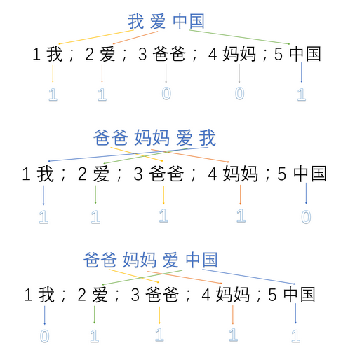

# My first share project of nlp

## that's cool!

## onehot编码
onehot本质上属于词典模型，最终一句话的向量维数是词袋中词的总数，假设有几句话：

1.我爱中国
2.爸爸妈妈爱我
3，爸爸妈妈爱中国
首先，将语料库中的每句话分成单词，并编号：

1：我      2：爱      3：爸爸      4：妈妈      5：中国

然后，用one-hot对每句话提取特征向量：

所以最终得到的每句话的特征向量就是：

1.我爱中国 -> 1，1，0，0，1
2.爸爸妈妈爱我 -> 1，1，1，1，0
3.爸爸妈妈爱中国 -> 0，1，1，1，1
